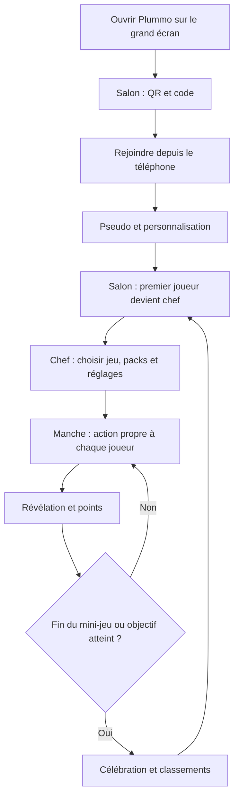

# Plummo — parcours et écrans de la V1

Date : 7 octobre 2026. Livrable : spécification UX pour préparer les maquettes, sans implémentation ni choix de stack.

## 1. Cadre et statut des propositions

[Le cadrage métier](metier-plummo.md) reste la source des règles validées. Ce document les traduit en parcours, contenus d'écran, actions et retours utilisateur. Les dispositions, libellés et outils d'édition décrits ici sont des **propositions de conception**, à éprouver sur les maquettes ; ils ne changent pas les barèmes ou les règles approuvées.

Les premières maquettes Figma posent déjà l'entrée par code, l'attente, la présence des participants et des variantes claire et sombre. Le salon consulté rassemble aussi sélection de jeu, QR code et bouton de lancement. Le nouveau parcours déplace les commandes sur le téléphone du chef, comme décidé ensemble. Les coches « prêt » des premières maquettes ne deviennent pas une condition de lancement : aucune validation individuelle supplémentaire n'a été décidée.

Trois surfaces ont des responsabilités distinctes :

| Surface | Question à laquelle elle répond | Action principale |
| --- | --- | --- |
| Grand écran | Que joue-t-on et que se passe-t-il ensemble ? | Afficher, diffuser le son et rythmer le jeu |
| Téléphone | Que dois-je faire maintenant ? | Répondre, dessiner, écrire, voter ou attendre |
| Administration | Quel contenu sera disponible pour jouer ? | Préparer, vérifier et publier |

Le chef utilise les mêmes écrans de jeu que les autres. Un accès discret à la pause et aux commandes de salon s'ajoute à son téléphone. Les réponses secrètes ne sont jamais affichées dans ces commandes.

## 2. Parcours d'ensemble

Pendant un mini-jeu, une arrivée ou une reconnexion ouvre une attente jusqu'à la prochaine manche. Une pause générale suspend les actions ; la reprise passe par cinq secondes de compte à rebours. La déconnexion du dessinateur dispose de son état particulier, décrit plus bas.

## 3. Entrer dans le salon

### Grand écran : invitation

L'ouverture prépare immédiatement le salon. Le premier écran présente un grand QR code, le code lisible et l'adresse courte de la page de saisie — adresse à choisir plus tard. Message : « Scanne le QR code ou saisis le code sur ton téléphone. » Une explication courte précise que le téléphone sert de manette.

Avant la première arrivée : « En attente du premier joueur ». Ensuite, les participants apparaissent avec leur Plummo, leur pseudo et l'indication du chef. Le compteur indique « 3 / 8 joueurs ». Le QR et le code restent accessibles dans le salon entre les jeux.

### Téléphone : rejoindre et se présenter

1. Un scan arrive directement dans le salon correspondant. L'entrée manuelle demande seulement le code, avec le bouton « Rejoindre ».
2. Le joueur choisit son pseudo, une couleur et jusqu'à deux accessoires. L'aperçu du Plummo reste visible pendant la personnalisation. Aucun contrôle d'unicité.
3. « Entrer dans le salon » confirme l'arrivée. Le joueur voit son personnage, son rôle et l'état du groupe.

Proposition : réunir pseudo et personnalisation sur une même page, avec les accessoires dans un panneau secondaire, pour conserver une entrée courte. Les choix de personnalisation ne doivent pas masquer le bouton d'entrée.

| Situation | Retour sur le téléphone | Suite |
| --- | --- | --- |
| Code inconnu | « Ce code ne correspond à aucun salon. » | Corriger le code |
| Salon fermé | « Ce salon est fermé. » | Revenir à la saisie |
| Salon plein | « Le salon est complet : 8 joueurs. » | Attendre une place ou revenir |
| Retour reconnu, place disponible | « Bon retour, [pseudo] ! » avec avatar et points | Restaurer sans refaire la personnalisation |
| Retour reconnu, salon plein | « Tes points sont conservés. En attente d'une place. » | Rester dans l'attente |
| Mini-jeu en cours | « Tu joueras à la prochaine manche. » | Attente et chat |

L'identité restaurée ne doit jamais dépendre du pseudo, puisque les doublons sont permis. L'expérience garantie concerne le retour depuis le même téléphone ; aucune récupération depuis un autre appareil n'est promise à ce stade.

## 4. Salon et préparation d'un mini-jeu

### Téléphone du joueur

Le salon montre son Plummo, son score global et le chef actuel. Trois actions : « Modifier mon Plummo » avec modification du pseudo, chat et menu contenant « Quitter le salon ». Le message principal indique soit « [pseudo] choisit le prochain jeu », soit le jeu en préparation.

### Téléphone du chef

L'action principale est « Choisir un mini-jeu ». Les quatre jeux sont présentés avec leur principe et leur minimum de participants. Si l'effectif est insuffisant, le jeu reste visible avec une raison explicite : « Il faut au moins 3 joueurs ». Les joueurs en attente d'une place ne comptent pas dans cet effectif.

La préparation suit le même ordre pour les quatre jeux :

1. **Jeu** : titre et règle courte ; rappel du mode chacun pour soi.
2. **Packs** : choisir de un à trois packs, avec le nombre de contenus disponibles sans répétition. Les recouvrements sont dédupliqués dans le total.
3. **Longueur** : questions, extraits ou tours, avec conversion explicite en manches.
4. **Durée** : temps de réponse, de dessin ou d'écriture, selon le jeu.
5. **Récapitulatif** : effectif, packs, quantité réelle et estimation, puis « Lancer ».

Les bornes et valeurs par défaut reprennent le cadrage métier. Les durées quiz et blind test restent séparées. Le temps de choix du mot, les durées de présentation et les 30 secondes de vote ne deviennent pas des réglages supplémentaires.

Exemple dessin : « 2 tours · 8 joueurs · 16 dessins · jusqu'à 90 s par dessin ». L'estimation doit inclure le choix du mot et les transitions et être présentée comme approximative. Pour les phrases, elle inclut écriture, présentation de toutes les phrases et vote. Les fins anticipées peuvent raccourcir la partie.

### Objectif et gestion du salon

Avant le premier lancement, le chef choisit « Sans limite » ou « Objectif de points », avec 1 000 proposé dans le second cas. Le salon indique clairement le mode choisi. Une fois la session commencée, l'objectif reste fixe jusqu'à son atteinte.

Dans le menu du chef : transmettre le rôle à un joueur connecté, consulter les classements et fermer le salon. La fermeture exige une confirmation explicite : « Fermer le salon ? Les scores et l'historique seront effacés. » Le bouton est distinct de « Quitter le salon ».

Le grand écran reflète le jeu et les packs en préparation, sans afficher les boutons de réglage. Il présente les participants et l'objectif éventuel. Message : « [pseudo] prépare la partie sur son téléphone. »

### Packs épuisés ou quantité insuffisante

Le chef reçoit une explication avant le lancement lorsque la pénurie est déjà connue : « Il reste 7 questions inédites pour ces packs ». Il peut ajuster la quantité dans les bornes permises, modifier les packs ou autoriser les répétitions. Si l'épuisement intervient pendant le jeu, un écran d'attente arrête l'enchaînement et demande au chef de choisir. Les autres voient « Choix des prochains contenus ».

Proposition : afficher le nombre de mots inédits et de groupes de trois disponibles pour le dessin. Une manche consomme trois mots vus, même si un seul est dessiné. Ne pas annoncer une rotation entièrement inédite en comptant seulement les mots choisis.

## 5. Pendant les mini-jeux

### Quiz : une question, une réponse définitive

| Phase | Grand écran | Téléphone |
| --- | --- | --- |
| Question | Question, quatre propositions repérées A–D, chrono, progression | Quatre boutons reprenant les mêmes propositions et repères |
| Réponse envoyée | Compteur global de réponses, sans détail individuel | Choix verrouillé, « Réponse envoyée », puis chat |
| Révélation | Bonne réponse mise en évidence ; animations des Plummos et points | Bonne réponse, son choix et ses points |
| Suite | Question suivante automatiquement | Nouvelle action, chat remplacé par les réponses |

Proposition : ne révéler la justesse sur le téléphone qu'à la fin de la manche, pour ne pas divulguer la réponse aux voisins encore en train de jouer. Le clic envoie directement : aucune deuxième confirmation qui modifierait la course à la rapidité.

### Blind test : huit choix disponibles immédiatement

L'extrait et les huit choix commencent ensemble. Chaque bouton affiche titre et artiste. Sur le grand écran, proposer les huit choix repérés A–H en complément du son, pour rester cohérent avec l'écran commun ; cette disposition est à confirmer sur maquette. Aucun choix n'apparaît progressivement.

Sur téléphone, proposition de départ : deux colonnes de quatre boutons. La lisibilité prime sur le fait de tout faire tenir : tester titres et artistes longs sur un petit écran ; si nécessaire, utiliser une liste avec défilement plutôt que réduire fortement le texte. Tous les choix sont disponibles dès le début, même lorsqu'un petit écran exige de défiler. Le compromis de disposition doit être validé avant de figer la maquette.

Après le choix : verrouillage, chat et résultat à la révélation, comme pour le quiz. La pause générale stoppe le son. La révélation affiche clairement le couple titre–artiste correct.

### Dessin : deux interfaces pendant la même manche

**Choix du mot.** Seul le dessinateur voit trois mots et le délai de 15 secondes. Le grand écran et les autres téléphones indiquent « [pseudo] choisit son mot ». Le mot choisi reste privé jusqu'à la révélation finale.

**Dessinateur.** Son téléphone affiche le mot, le chrono, une grande zone de dessin et quelques outils. Proposition d'outils pour la maquette : crayon, gomme, quelques couleurs, annuler et effacer le dessin avec confirmation. Ce périmètre d'outils reste à valider. Éviter de faire défiler la page pendant le tracé ; prévoir une présentation utilisable en paysage sans le rendre obligatoire.

**Devineurs.** Le téléphone montre un champ et « Envoyer », le chrono, ainsi que le dernier retour privé. Une tentative erronée permet de réessayer ; une tentative proche affiche « Presque ! Vérifie l'orthographe. » La bonne réponse verrouille les propositions pour ce dessin et ouvre le chat. Les réponses envoyées ne sont pas diffusées publiquement.

**Grand écran.** Le dessin occupe la zone principale. Le nom du dessinateur et le nombre de joueurs ayant trouvé restent visibles, avec les Plummos et leurs animations. Aucun indice textuel sur le mot n'est ajouté. En fin de manche, le mot est révélé, les points du dessinateur sont présentés, puis le prochain choix commence.

**Dessinateur absent.** Le dessin reste visible et le chrono est figé. Les devineurs conservent leur champ, sauf s'ils ont déjà trouvé. Tous les autres joueurs connectés peuvent choisir « Passer ce dessin » ; un compteur indique les votes requis et reçus. Le message précise : « Vous pouvez encore deviner. Les points gagnés sont conservés. » Au retour du dessinateur, vote annulé puis compte à rebours de cinq secondes. Cet écran ne porte pas le même titre qu'une pause générale.

### Phrase à compléter : écrire, découvrir, voter

1. **Écriture** : début commun sur le grand écran et le téléphone. Sur téléphone, champ de suite avec compteur « 42 / 150 », aperçu de la phrase complète et « Valider ma phrase ». Après validation, attente et chat. À la fin du temps, le brouillon non vide est envoyé automatiquement.
2. **Présentation** : une phrase complète à la fois sur le grand écran, sans nom ni avatar d'auteur. Progression « Proposition 3 / 8 ». La durée dépend de la longueur selon la formule validée. Téléphones : « Regarde les propositions sur le grand écran », chat disponible.
3. **Vote** : toutes les phrases ensemble sur le grand écran ; liste complète sur téléphone. Sa propre phrase est identifiée localement et non sélectionnable. Un clic envoie le vote définitif ; ensuite, attente et chat. Les auteurs des autres propositions restent secrets.
4. **Résultat** : phrases avec pseudo, Plummo, nombre de votes et points ; gagnants ex æquo montrés ensemble. Le téléphone rappelle les votes reçus et son gain. Aucun bonus de podium.

Le nombre de propositions affichées correspond aux phrases effectivement soumises, pas au nombre de joueurs initial. Le rendu doit supporter huit phrases longues sans texte minuscule : conserver des zones lisibles sur TV et tester un récapitulatif dense. L'écran de vote sur téléphone peut défiler.

Deux cas rares nécessitent encore une décision métier explicite : aucune phrase soumise ; une seule phrase soumise, dont l'auteur ne peut voter pour lui-même. Proposition à examiner : sans phrase, passer au résultat sans points ; avec une phrase, seuls les joueurs disposant d'un choix admissible sont attendus pour le vote, puis distribution selon les votes réels. Ne pas inventer de vote automatique.

## 6. Résultats et retour au salon

La fin du mini-jeu affiche d'abord une célébration brève du ou des gagnants. Ensuite, le grand écran présente le classement du mini-jeu et le classement global, avec des intitulés distincts. Proposition : le chef passe d'un classement à l'autre depuis son téléphone puis choisit « Retour au salon » ; les révélations de manches restent, elles, entièrement automatiques.

Les joueurs voient leur gain du mini-jeu et leur score global. Les anciens participants dont les scores sont conservés peuvent apparaître dans les classements avec un statut « Parti » : proposition de présentation pour ne pas confondre scores historiques et places occupées.

Si l'objectif global a été atteint, la manche s'achève puis la célébration globale prend la priorité. Le téléphone du chef propose :

- « Continuer sans limite » : scores conservés.
- « Ajouter un objectif » : saisir un nombre de points supplémentaires, avec aperçu du seuil calculé depuis le meilleur score actuel.
- « Recommencer à zéro » : confirmation, puis choix du nouvel objectif facultatif. Joueurs, Plummos et contenus vus conservés.

Exemple affiché : « Meilleur score : 1 180. Encore 500 points → nouvel objectif : 1 680. » Éviter le libellé ambigu « Ajouter 500 au seuil ».

## 7. Pauses, reconnexion et disponibilité

| État | Grand écran | Téléphone du joueur | Action du chef |
| --- | --- | --- | --- |
| Pause manuelle | « Partie en pause », contenu conservé | Actions suspendues, chat | Reprendre, transmettre le rôle, arrêter le mini-jeu, fermer le salon |
| Grand écran déconnecté | Affichage local de reconnexion si possible | « En attente du grand écran », actions suspendues | Attendre la reconnexion ; commandes de gestion accessibles |
| Reprise | Décompte de 5 à 1 | Même décompte, commandes de jeu encore bloquées | Aucune action supplémentaire pendant le décompte |
| Téléphone reconnecté en cours de manche | Le mini-jeu continue | Identité restaurée, « Tu reprends à la prochaine manche » | Relais de rôle selon les règles |
| Aucun joueur connecté | Partie en pause, salon conservé 30 minutes | Écran de retour si reconnexion | Reprise si grand écran connecté et manche jouable |
| Effectif devenu insuffisant | « En attente de joueurs » | Raison et attente | Retour au salon ou attente : parcours proposé à préciser selon le jeu |

La présence du grand écran ne suffit pas à interrompre le délai d'absence de tous les joueurs. Un salon avec des joueurs connectés n'expire pas simplement parce qu'ils attendent ou ont mis en pause.

Au transfert du chef, le nouveau chef reçoit un message court et ses commandes apparaissent. Les autres voient le nouveau nom de chef. Un relais temporaire est signalé comme tel ; le retour du chef initial rétablit son rôle, sauf transfert volontaire intervenu entre-temps.

« Arrêter le mini-jeu » n'apparaît que sur l'écran de pause du chef. Confirmation proposée : « Revenir au salon ? Les points de cette manche seront annulés. Ceux des manches terminées sont conservés. » Cette action est distincte de « Passer ce dessin », qui conserve les points du dessin en cours.

## 8. Chat et présence des Plummos

Le chat est une fonction de l'écran d'attente, pas une page séparée. Il apparaît dès qu'aucune action personnelle n'est attendue et disparaît lorsque la prochaine action commence. Champ de 80 caractères, bouton « Envoyer », retour d'envoi et délai visible de trois secondes avant le suivant.

Sur le grand écran, la zone des Plummos reste en bas à droite. Proposition : deux rangées de quatre personnages au maximum, chacun avec son pseudo. Les bulles vivent cinq secondes, une par joueur ; une nouvelle bulle remplace la précédente. Prévoir des emplacements de bulles qui limitent les chevauchements sans masquer la question ou le dessin. À éprouver avec huit messages simultanés, plutôt qu'ajouter une nouvelle règle de modération non demandée.

Les animations de points ne doivent pas recouvrir un bouton de réponse ni retarder l'action suivante. Un gain peut accompagner un petit saut du Plummo. Un état textuel complète toujours la couleur et l'animation. Prévoir une variante avec mouvements réduits.

## 9. Administration : préparation et publication

L'absence de compte concerne les joueurs. L'accès des administrateurs doit être protégé ; la méthode d'accès et les permissions administratives restent à définir, sans imposer de solution technique maintenant.

### Navigation et gestion individuelle

Proposition de navigation : « Contenus », « Tags », « Packs », « Imports ». La liste des contenus se filtre par mini-jeu, tags et statut. Chaque ligne ouvre son formulaire ; action « Ajouter un contenu » adaptée au jeu choisi.

| Type | Champs indispensables | Contrôles avant publication |
| --- | --- | --- |
| Quiz | Question, quatre réponses, bonne réponse, tags | Quatre réponses remplies ; une bonne réponse ; signaler les choix identiques |
| Blind test | Titre, artiste, extrait préparé, tags | Fichier associé et écoutable ; signaler les couples titre–artiste identiques ; catalogue capable de produire huit choix distincts |
| Dessin | Mot, tags | Mot présent ; aperçu de la graphie exacte attendue ; pas de difficulté |
| Phrase | Début de phrase, tags | Texte présent ; aperçu avec une suite d'exemple clairement fictive |

Proposition de statuts : « Brouillon » et « Publié ». Seuls les contenus publiés participent au tirage. « Enregistrer en brouillon » conserve un travail incomplet ; « Publier » vérifie les champs. Prévoir l'aperçu TV et téléphone avant publication. La gestion d'une modification de contenu déjà engagé dans une manche doit être précisée avant implémentation ; proposition : conserver cette manche avec le contenu initial.

### Tags et packs

Le formulaire de pack contient le nom et les tags requis. Au-dessus de l'aperçu : « Un contenu doit avoir tous ces tags pour appartenir à ce pack. » Le résultat indique les quantités par mini-jeu. Ajouter un tag réduit ou conserve l'ensemble admissible ; il ne réunit pas deux catégories par un OU.

Exemple illustré : tags requis « Cinéma » + « Années 2000 » → seulement les contenus possédant les deux, même s'ils ont aussi d'autres tags. Un pack vide peut être préparé, mais ne doit pas être proposé comme pack jouable pour un jeu sans contenu.

Proposition : fournir recherche et sélection de tags existants, avec création explicite d'un nouveau tag. Ne pas créer silencieusement des variantes à cause d'une faute de frappe. Suppression ou renommage d'un tag : montrer les contenus et packs concernés avant toute modification.

### Import Excel et CSV

Parcours : choisir un mini-jeu → télécharger le modèle → charger le tableau → ajouter les extraits si blind test → vérifier l'aperçu → corriger ou importer les lignes valides → bilan.

Colonnes proposées pour les modèles, une ligne par contenu :

| Modèle | Colonnes |
| --- | --- |
| Quiz | `question`, `reponse_a`, `reponse_b`, `reponse_c`, `reponse_d`, `bonne_reponse`, `tags` |
| Blind test | `titre`, `artiste`, `fichier_audio`, `tags` |
| Dessin | `mot`, `tags` |
| Phrase | `debut_phrase`, `tags` |

Convention proposée : `bonne_reponse` contient A, B, C ou D ; `tags` contient des noms séparés par `|`, par exemple `Cinéma|Années 2000`. Fournir un fichier d'exemple et une aide expliquant cette convention, y compris les cellules contenant guillemets ou retours à la ligne en CSV. Les formats et limites des fichiers audio restent à définir ; ne pas afficher une liste de formats inventée.

L'aperçu montre les lignes reconnues, les valeurs interprétées, les erreurs et les avertissements. Une erreur indique la ligne, le champ et la correction attendue. Les tags inconnus demandent une association ou une création explicite. Un doublon potentiel est signalé, sans décider silencieusement de remplacer un contenu.

Pour le blind test, associer les noms du tableau aux fichiers fournis. Signaler fichier absent, nom ambigu ou fichier inutilisé. Permettre d'écouter chaque extrait reconnu. Aucune découpe audio dans cet écran.

Proposition : importer les lignes valides en brouillon, puis permettre leur publication en lot après contrôle. Cette séparation rend la validation explicite ; elle doit être confirmée avec le parcours admin final. Les lignes invalides restent consultables et exportables avec leurs erreurs pour correction. Le bilan donne les quantités effectivement ajoutées, publiées et refusées.

## 10. Inventaire pour les maquettes

Un écran peut avoir plusieurs états ; les variantes ne sont pas forcément des pages de navigation différentes.

| ID | Surface | Écran / états à représenter |
| --- | --- | --- |
| TV-01 | Grand écran | Invitation vide, salon avec joueurs, préparation du jeu |
| TV-02 | Grand écran | Quiz actif et révélation |
| TV-03 | Grand écran | Blind test actif et révélation titre–artiste |
| TV-04 | Grand écran | Choix du mot, dessin actif, dessinateur absent, mot révélé |
| TV-05 | Grand écran | Écriture, phrase anonyme seule, récapitulatif de vote, auteurs révélés |
| TV-06 | Grand écran | Célébration mini-jeu / globale, deux classements |
| TV-07 | Grand écran | Pause, reprise, attente de joueurs, salon fermé |
| TEL-01 | Téléphone | Saisie du code, code invalide, salon fermé ou plein |
| TEL-02 | Téléphone | Pseudo et personnalisation |
| TEL-03 | Téléphone | Salon joueur / chef, attente de prochaine manche, chat |
| TEL-04 | Téléphone chef | Sélection jeu, packs, réglages, objectif, récapitulatif |
| TEL-05 | Téléphone | Quiz / blind test, réponse envoyée, résultat |
| TEL-06 | Téléphone | Choix du mot, outils du dessinateur |
| TEL-07 | Téléphone | Deviner, tentative proche, mot trouvé, vote pour passer |
| TEL-08 | Téléphone | Écrire une suite, attente de présentation, vote, résultat |
| TEL-09 | Téléphone | Pause joueur / chef, reprise, perte de connexion |
| TEL-10 | Téléphone chef | Fin avec objectif atteint, prolonger, recommencer, confirmations |
| ADM-01 | Administration | Liste filtrée, absence de contenu, recherche vide |
| ADM-02 | Administration | Formulaire de chaque type, aperçu, erreurs, publication |
| ADM-03 | Administration | Tags, pack et aperçu de ses contenus |
| ADM-04 | Administration | Import, association audio, aperçu des erreurs, bilan |

Ordre conseillé de maquetter : entrée et salon en paire TV/téléphone ; préparation chef ; quiz et blind test ; dessin ; phrases ; résultats et incidents ; administration. Dessiner à chaque étape le grand écran et le téléphone au même instant pour vérifier leur complémentarité.

## 11. Critères de relecture des futures maquettes

- Une famille comprend comment rejoindre avec ou sans scan, sans créer de compte.
- Le chef lance et pilote tout depuis son téléphone, sans voir de réponse secrète.
- Huit joueurs, des pseudos identiques et des titres longs restent compréhensibles.
- Le sens d'un tour de dessin et sa durée ne surprennent pas après lancement.
- Une réponse définitive n'offre pas de faux bouton de modification.
- Les phrases restent anonymes jusqu'au résultat ; voter pour soi est impossible.
- Les actions du jeu sont utilisables au doigt ; la saisie et le clavier ne cachent pas l'envoi.
- La TV reste lisible à distance ; les informations principales ne dépendent pas seulement de la couleur.
- Une reconnexion explique immédiatement quand le joueur pourra agir et conserve ses données.
- Les pauses générales et l'absence du dessinateur n'encouragent pas les mêmes actions.
- Fermer, arrêter un mini-jeu, passer un dessin et quitter ne sont pas confondus.
- L'admin comprend les tags requis d'un pack et les erreurs d'import sans connaître le code.

## 12. Décisions résiduelles à traiter sur les maquettes

Les points suivants sont isolés pour ne pas leur donner artificiellement le statut de règle approuvée :

1. Absence de phrase ou phrase unique et fin du vote sans choix admissible.
2. Transition quand l'effectif restant ne permet plus de jouer, notamment entre deux dessins.
3. Présentation des résultats : cadence, passage entre classements et retour au salon.
4. Disposition des huit choix musicaux sur les petits téléphones et le grand écran.
5. Outils de dessin et politique de publication des imports.
6. Accès des administrateurs, formats audio et comportement des éditions pendant une partie.

Ces points n'empêchent pas de commencer les maquettes. Ils doivent être validés avant de spécifier définitivement leur comportement ou d'implémenter le produit.
